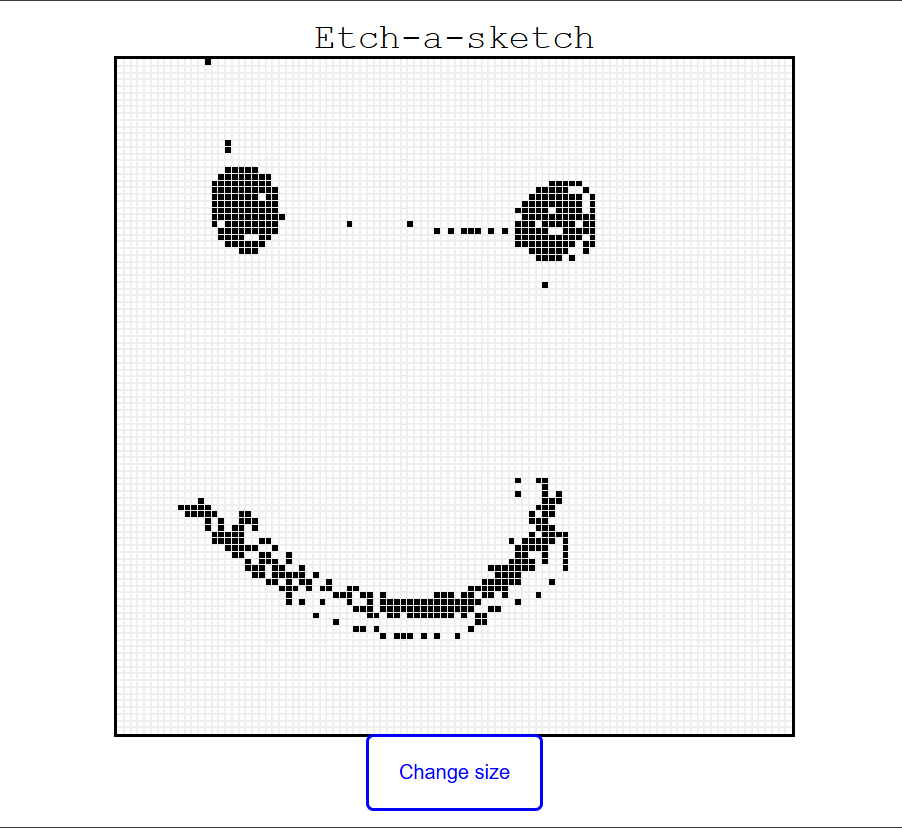

# 🧱 Etch-a-sketch 

This is a simple **JavaScript-powered grid generator** that allows users to interactively draw on a grid of pixels using mouse hover. The grid size is adjustable via user input.

---

## 🚀 Features

- Generates a flexible `n × n` grid inside a fixed-size container.
- Each grid cell ("pixel") changes color on mouseover.
- User can regenerate the grid by entering a new size (from 1 to 100).
- Clean and responsive layout using **vanilla JavaScript** and **CSS Flexbox**.
- Simple and hackable — great for learning or experimenting.

---

## 🖥️ Demo/Visual

<!--  -->

> You can interact with the grid in your browser: hover over the squares to "draw".

---

## 🧑‍💻 How It Works

1. The JavaScript calculates how many pixels to place per row/column.
2. It sets each `.pixel` element to fit precisely within a 450×450px container.
3. The user can click a button to set a new size (`n`) and regenerate the grid.
4. When hovering over a `.pixel`, the background color turns black.

---

## 📦 Files Overview

```bash
project-root/
│
├── index.html        # Basic HTML page with container and button
├── styles.css        # Contains styling for the grid and pixels
├── script.js         # All the dynamic grid generation and logic
└── README.md         # This file
```
---

## 🙋‍♂️ Creator

phiriungweru@gmail.com

Feel free to reach out with suggestions, improvements, or questions.

---

## License
This project is free and open-source.
No license required. Use it, modify it, share it — no strings attached.
